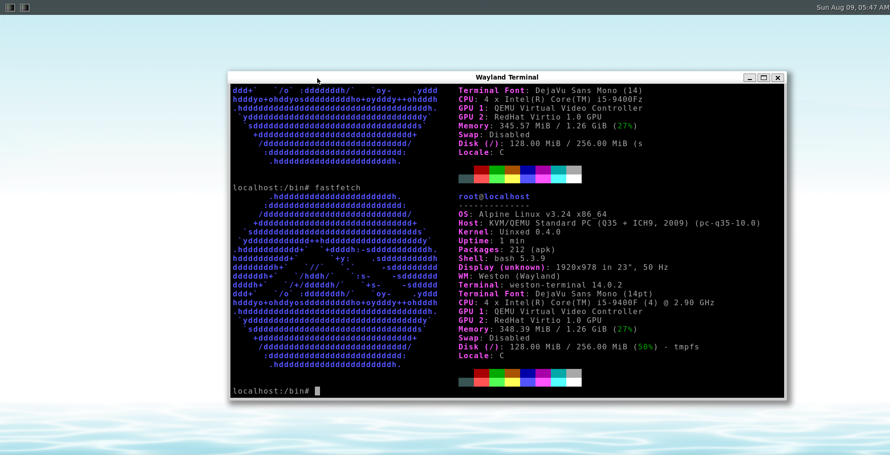

<div align="center">
  
  <h1 align="center">Uinxed-Kernel</h1>
  <h3 align="center">A UNIX-like x86-64 kernel written from scratch.</h3>
</div>

<div align="center">
  
  
  
  
  <a href="https://deepwiki.com/ViudiraTech/Uinxed-Kernel"></a>
</div>

---

## Overview

Uinxed is a monolithic, UNIX-like operating system kernel for x86-64, written from scratch in C. It boots through the [Limine](https://limine-bootloader.org/) bootloader in both UEFI and Legacy mode, brings up all cores via SMP, and implements a Linux-compatible syscall ABI (Linux 6.12 x86-64 numbering, syscalls 0–462).

The project aims to build a practical, self-contained kernel with modern design principles: an EEVDF scheduler, a unified page cache with swap support, a full VFS with multiple filesystems, a Linux-style networking and socket layer, and a growing set of device drivers. Unimplemented syscalls return `-ENOSYS`, keeping the ABI surface predictable as it grows.

> **Current status:** The current development image boots Alpine Linux 3.24 on x86-64 and can bring up the Weston (Wayland) desktop with a working terminal. The PS/2 keyboard/mouse path, evdev consumers, poll/epoll wakeups, and the EEVDF scheduler are under active validation. This remains an experimental kernel; GPU, VirtIO, audio, and parts of the Linux-compatible ABI may still be incomplete.

## Weston Desktop Showcase

The screenshot below shows Alpine Linux running on Uinxed-Kernel with Weston and a Wayland terminal. It also shows the kernel and userspace information reported by `fastfetch`.

<div align="center">
  
  <p><em>Alpine Linux 3.24 running Weston (Wayland) on Uinxed-Kernel.</em></p>
</div>

The current desktop bring-up focuses on keeping the complete input and display path responsive:

- PS/2 IRQs are translated into Linux-style `EV_KEY` / `EV_REL` / `SYN_REPORT` events.
- evdev clients receive independent queued frames and readiness notifications through the normal VFS poll/epoll path.
- EEVDF runqueue accounting is rebased correctly, with desktop-oriented timer and latency settings.

## Core Features

### Scheduling & Process Management
- EEVDF (Earliest Eligible Virtual Deadline First) scheduler with per-CPU runqueues and a red-black tree timeline (`vruntime`, `deadline`, `vlag`, `weight`)
- SMP-aware task placement, CPU migration, load balancing, and IPI-based preemption
- Two-phase wait queues that avoid lost wakeups, plus timed waits backed by the scheduler timer queue
- Priority Inheritance (PI) for robust mutex and futex semantics
- Kernel threads and user processes with per-process VMAs, file descriptor tables, and credentials
- Linux-compatible `ptrace` and cgroups with a pids controller

### Memory Management
- Physical frame allocator (binary buddy) and standard 4-level paging with 4 KiB, 2 MiB, and 1 GiB pages
- Higher-half direct map (`HHDM`) and a buddy-backed kernel heap/slab allocator
- Unified page cache with page locking, LRU reclaim, dirty-page writeback, readahead, and truncation
- Swap subsystem for anonymous memory: multiple swap areas, slot allocation, and swap-in/swap-out fault handling

### VFS & Filesystems
- UNIX-style virtual filesystem with mount points, inode-like nodes, and a callback-based driver interface
- tmpfs as the default root filesystem; procfs, sysfs, devtmpfs, cpio, and cgroupfs for virtual views
- FAT12/16/32 (via the FatFS library), ext2/ext3/ext4, NTFS (with write support), and ISO 9660 (with Rock Ridge)

### Networking
- In-house protocol stack: Ethernet, ARP, IPv4/IPv6, ICMP/ICMPv6, NDP, UDP, and TCP
- Intel e1000/e1000e driver (82540EM, 82545EM, 82546EB, 82541PI, 82574L) and a generic network-device abstraction
- Linux `AF_INET` / `AF_INET6` socket ABI (`SOCK_DGRAM` / `SOCK_STREAM`), a DHCP client, and `/proc/net` / `/sys/class/net` views

### ABI & IPC
- Linux x86-64 syscall ABI (Linux 6.12 numbering, 0–462)
- `AF_UNIX`, `AF_NETLINK`, `AF_INET`, `AF_INET6` sockets
- pipes, `epoll`, `eventfd`, `timerfd`, `signalfd`, `memfd`, POSIX message queues, and System V IPC
- futexes with Priority Inheritance; `mmap` / `munmap` / `mremap` backed by the page cache
- POSIX termios and Linux TTY ioctls, including Unix98 PTYs
- Loadable kernel modules via `init_module` / `finit_module` / `delete_module`

### Drivers
- **Input:** PS/2 keyboard and mouse, Linux-compatible `evdev`, USB HID (keyboard, mouse, consumer control)
- **Storage:** IDE/ATA, AHCI (SATA), NVMe, and USB Mass Storage (Bulk-Only Transport / SCSI)
- **Audio:** Sound Blaster 16, Intel HD Audio, and an ALSA-compatible PCM/control ABI
- **Display:** DRM/KMS core, GOP framebuffer console with bitmap fonts, and an optional VirtIO-GPU driver
- **Bus:** PCI/PCIe (ECAM + legacy), USB host controllers (UHCI/OHCI/EHCI/xHCI), and I2C
- **Platform:** ACPI, HPET, RTC, serial, IEEE 1284 parallel port, and TPM (TIS/CRB, TPM 1.2/2.0)

## Architecture

The kernel boots through Limine, which hands off to `kernel_entry()` in `init/main.c`. Early init brings up SIMD state, serial output, the physical allocator, paging, and the heap; the platform layer then probes ACPI, TPM, TSC, and SMP before drivers and filesystems are registered. Process management, IPC, and the scheduler are initialized last, after which the bootloader-provided `init` userspace is loaded as PID 1 and scheduling starts.

```
Limine (UEFI/Legacy)
        │
        ▼
┌────────────────────────────┐     ┌──────────────────────────────┐
│ Early init                 │────▶│ Platform & drivers          │
│ FPU/SSE → serial → alloc   │     │ ACPI → SMP → PCI → storage  │
│ paging → heap → modules    │     │ net → audio → input → USB   │
└────────────────────────────┘     └──────────────────────────────┘
        │                                     │
        ▼                                     ▼
┌────────────────────────────┐     ┌──────────────────────────────┐
│ VFS & filesystems          │     │ Kernel services              │
│ tmpfs/procfs/sysfs → FAT   │     │ scheduler → processes → IPC  │
│ ext/NTFS/ISO9660           │     │ syscalls → signals → cgroups │
└────────────────────────────┘     └──────────────────────────────┘
        │                                     │
        └────────────────┬────────────────────┘
                         ▼
              sched_start() → init (PID 1)
```

## Getting Started

### Prerequisites

- **make**, **gcc** (13.3+ recommended), **qemu**, **xorriso**
- **clang-format**, **clang-tidy** (formatting and static analysis)
- **kconfig-frontends** + **libncurses-dev** (for `menuconfig`)

Debian/Ubuntu:

```bash
sudo apt update
sudo apt install make gcc qemu-system xorriso clang-format clang-tidy kconfig-frontends libncurses-dev dos2unix
```

ArchLinux:

```bash
pacman -Sy make gcc qemu-system xorriso clang-format clang-tidy kconfig-frontends libncurses-dev dos2unix
```

### Build

```bash
git clone https://github.com/ViudiraTech/Uinxed-Kernel.git
cd Uinxed-Kernel
make
```

This produces `UxImage` (the kernel image) and `Uinxed-x64.iso` (a bootable CD image).

### Run in QEMU

```bash
make run
```

`make run` boots the ISO with `-machine q35`, OVMF firmware, and `-serial stdio`, so serial output appears in your terminal.

### Run on physical hardware

**UEFI mode**

1. Convert the target drive to a GPT partition table and create an ESP.
2. Copy the contents of `./assets/Limine` to the ESP.
3. Copy `UxImage` to `EFI/Boot/` on the ESP.
4. Boot in 64-bit UEFI mode (Secure Boot disabled).

**Legacy mode**

1. Burn `Uinxed-x64.iso` to a drive.
2. Boot from it on a 64-bit machine.

Both modes also work via [Ventoy](https://www.ventoy.net/): copy the ISO onto the drive and select it from the boot menu.

## Project Layout

```
Uinxed-Kernel/
├── assets/           # Static resource files (bootloader, init userspace, linker script)
├── boot/             # Boot related
├── docs/             # Related documents
├── drivers/          # Device drivers
├── fs/               # File systems
├── include/          # Header files
├── init/             # Kernel entry
├── ipc/              # Inter-process communication
├── kernel/           # Kernel core
├── libs/             # Library files
├── mem/              # Memory management
├── net/              # Networking stack
├── tools/            # Host-side tools
├── .clang-format     # Formatting configuration
├── .clang-tidy       # Static analysis configuration
├── .clangd_template  # Clangd configuration template
├── .config-default   # Default configuration options
├── .gitignore        # Ignore rules
├── Kconfig           # Kernel configuration
├── LICENSE           # Open source license
├── Makefile          # Build script
├── README.md         # Project introduction
└── SECURITY.md       # Security policy
```

## FAQ

**What development commands are available?**

Run `make help` to list all supported targets (format, check, menuconfig, gen.clangd, etc.).

**"XXX.h file not found" errors in my editor?**

If you use clangd as your LSP server, generate a project config with:

```bash
make gen.clangd
```

For other LSP servers, adapt your configuration from the Makefile.

**How do I read the kernel log?**

Log output is sent to the boot console. By default it goes to the screen (`tty0`, set via `kernel_cmdline: console=tty0` in `assets/Limine/Limine/limine.conf`). To capture logs over a serial port:

1. Change `kernel_cmdline` in `limine.conf` to `console=ttyS0` (or `ttyS1`–`ttyS3`).
2. Rebuild and run. `make run` already attaches QEMU's serial output to your terminal (`-serial stdio`).

The `console=` parameter accepts `tty0` (VGA screen) and `ttyS0`–`ttyS3` (serial ports). Note that the screen console buffers output and may drop data if the VGA queue overflows or the kernel hangs mid-boot; a serial console is the reliable way to debug hangs. `plogk` debug messages are compiled in only when `CONFIG_KERNEL_LOG` is enabled.

**Are all Linux syscalls implemented?**

No. The syscall table follows Linux 6.12 x86-64 numbering (syscalls 0–462), but only a subset is implemented. Unimplemented syscalls return `-ENOSYS` instead of crashing, and the set grows as the project develops.

**Why isn't a driver I expected working (e.g. VirtIO-GPU, SB16)?**

Some subsystems are disabled by default in Kconfig. For example, `VIRTIO` and `VIRTIO_GPU` default to `n`, and `SOUND_SB16` defaults to `n`. Enable them with `make menuconfig` (requires kconfig-frontends and libncurses-dev), then make sure the corresponding device is present in your VM or on your hardware. The build reads `.config` if present, otherwise `.config-default`; the generated `.config` takes precedence.

**Can I run this on real hardware?**

Yes, but treat it as an experimental kernel. Follow the physical-hardware steps above, and prefer disposable machines or test disks — filesystem drivers (especially the NTFS writer) are not yet safe for important data.

## Contributing

Contributions are welcome! Follow these steps:

1. Fork the repository and clone it to your local machine.
2. Make your changes.
3. Run static analysis to make sure nothing is broken: `make check`
4. Format your code: `make format`
5. Push to your fork and open a Pull Request against `master`.

### Submit an Issue

Encountering a bug? File an issue — we welcome them all. A few guidelines:

1. **Describe the problem in as much detail as possible.** Logs and code snippets go a long way toward understanding what happened.
2. **Just be polite.** A respectful report gets solved smoothly; hostility helps nobody.
3. **No need to be overly formal.** Casual is fine — we are partners in making this project better.
4. **Your native language is welcome.** You may write in any language, but keep in mind that typos can confuse translation tools.

## Referenced Projects

- [Hurlex-Kernel](http://wiki.0xffffff.org/)
- [CoolPotOS](https://github.com/plos-clan/CoolPotOS)

## License & Disclaimer

### License

This project is licensed under the Apache 2.0 License. See [LICENSE](LICENSE) for details.

### Disclaimer

Uinxed is an experimental kernel under active development. It is provided "as is", without warranty of any kind, express or implied, including but not limited to the warranties of merchantability or fitness for a particular purpose.

- The kernel and its filesystem drivers (including the NTFS writer) are **not** safe for production data. Use only with disposable disks or virtual machines.
- Hardware support is incomplete; running on untested real hardware may cause hangs, crashes, or data loss.
- The project is not affiliated with Linux, Limine, or any referenced open-source project. All trademarks belong to their respective owners.

By using this software you acknowledge that you do so at your own risk.

## Contact

- Email: rainy101112@163.com | 2609948707@qq.com | 3585302907@qq.com
- Discord: [Join the server](https://discord.gg/nTkg7HCpy7)
- QQ Group: [983673299](https://qm.qq.com/q/8goacFf1iU)
